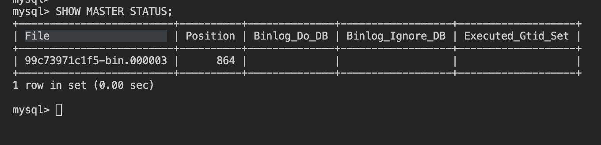
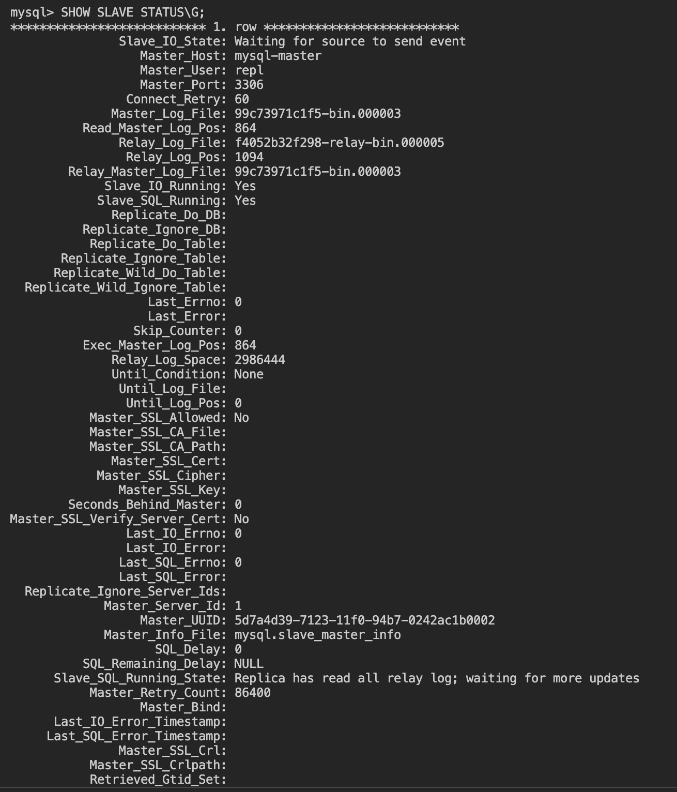

Домашнее задание к занятию "`Репликация и масштабирование. Часть 1`" - `Кошель Николай Павлович`

### Задание 1

На лекции рассматривались режимы репликации master-slave, master-master, опишите их различия.

*Ответить в свободной форме.*

---
//
Master-Slave (Мастер-слэйв) //один главный, остальные копии для чтения//:

В этом режиме есть один основной сервер (мастер), который принимает все операции записи.
Остальные серверы (слэйвы) служат копиями мастера и используют только для чтения данных.
Репликация односторонняя: изменения идут только от мастера к слэйвам.
Хорошо подходит для масштабирования чтения, так как чтение можно распределить между несколькими слэйвами.
Недостаток: при сбое мастера невозможно писать данные, и возможна задержка синхронизации.

Master-Master (Мастер-мастер) //оба сервера одновременно читают и пишут, требует сложных механизмов синхронизации//:

В этом режиме оба сервера могут выполнять операции чтения и записи.
Изменения, внесённые на один мастер, автоматически синхронизируются с другим.
Обеспечивает высокую доступность и балансировку нагрузки.
Требуется сложная конфигурация для предотвращения конфликтов при одновременных изменениях.

### Задание 2

Выполните конфигурацию master-slave репликации, примером можно пользоваться из лекции.

*Приложите скриншоты конфигурации, выполнения работы: состояния и режимы работы серверов.*

---
//

Запустить скрипт [setup_master.sh](setup_master.sh), он покажет текущий статус, скопировать File и Position.
В скрипте [setup_slave.sh](setup_slave.sh) вставить значения (File и Position) и запустить его.

